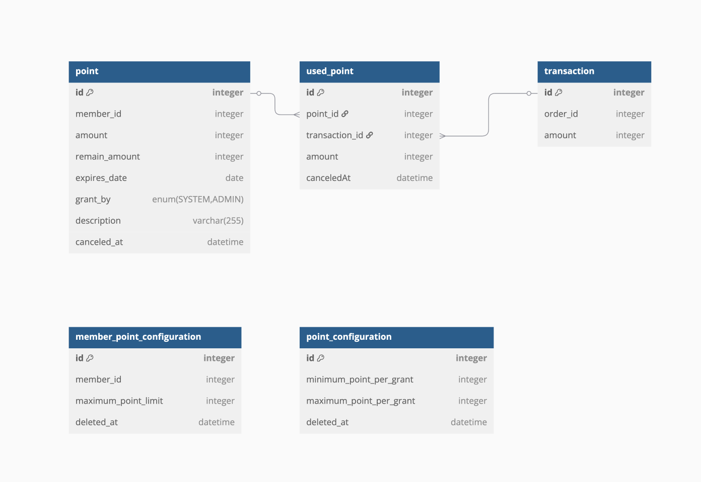
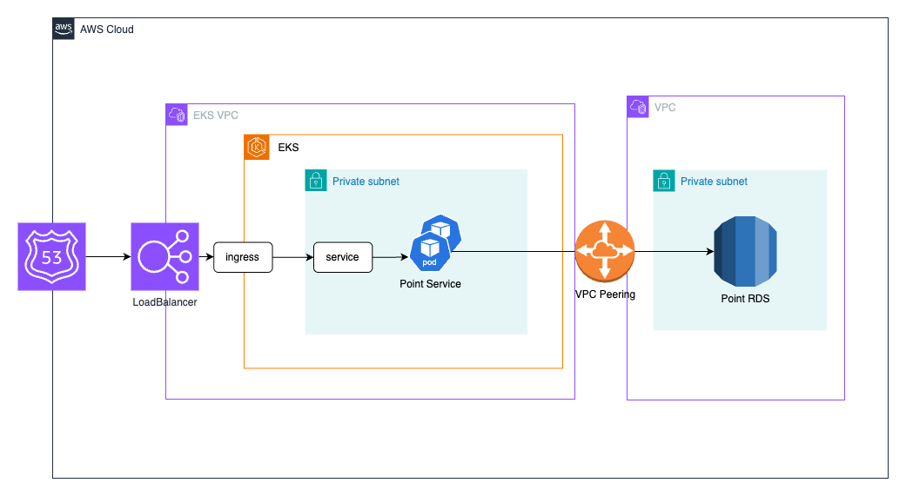

# Reward Point

## 목차

- [프로젝트 구조](#프로젝트 구조)
- [실행](#실행)
- [ERD](#ERD)
- [아키텍처](#아키텍처)

## 프로젝트 구조

### 패키지 구조

- common
    - 에러 핸들링을 위한 Exception 패키지
    - 어플리케이션 설정을 위한 configuration 패키지
    - 공통으로 사용되는 유틸성 클래스 및 상수들이 추가될 수 있습니다.
- inbound
    - 외부로부터 요청을 받기 위한 패키지
    - Rest Controller, gRPC, Kakfa Consumer 등 외부 요청을 처리하는 개념들이 위치할 수 있습니다..
- dto
    - API 요청 및 응답을 위한 DTO 패키지
- service
    - 비즈니스 로직을 처리하는 서비스 패키지
    - 포인트 적립 및 사용에 대한 서비스 로직을 처리합니다.
- outbound
    - 외부로 요청을 보내기 위한 패키지
    - DB, Kafka Producer, 외부 API 호출 등 외부로 요청을 보내는 개념들이 위치할 수 있습니다.
- domain
    - 도메인 모델들이 존재하는 패키지

## 실행

### 사전 준비

- JDK 21
- Gradle 8.x

### 빌드

```shell
./gradlew clean build
```

### API 명세

서버 실행 후 [스웨거](http://localhost:8080/swagger-ui/index.html)를 통해서 API 명세를 확인할 수 있습니다.

---

## ERD



### point

회원별 포인트를 저장하는 테이블
회원별로 적립되는 건당 포인트 금액을 누적하여 생성되는 데이터

- `id`: 포인트 ID
- `member_id`: 회원 ID
- `amount`: 포인트 금액
- `remain_amount`: 잔여 포인트 금액
- `grant_by`: 포인트 발급 주체
- `description`: 포인트 발급 정보성 데이터

### used_point

포인트별 사용 내역을 저장하는 테이블

- `id`: 사용 내역 ID
- `point_id`: 포인트 ID
- `transaction_id`: 포인트가 사용된 주문 정보
- `amount`: 사용된 금액
- `canceled_at`: 사용 취소 일시

### transaction

주문 정보를 저장하는 테이블

- `id`: Transaction ID
- `order_id`: 주문 ID
- `amount`: 주문에서 사용된 포인트 금액

### member_point_configuration

회원별 포인트 사용 설정을 저장하는 테이블

- `id`: 설정 ID
- `member_id`: 회원 ID
- `maximum_point_limit`: 최대 적립 가능 포인트 금액
- `deleted_at`: 삭제 일시

### point_configuration

포인트 사용 설정을 저장하는 테이블

- `id`: 설정 ID
- `maximum_point_per_grant`: 건당 최대 포인트 발급 금액
- `minumum_point_per_grant`: 건당 최소 포인트 발급 금액
- `deleted_at`: 삭제 일시

---

## 아키텍처



AWS EKS 환경에서 서비스를 운영한다는 가정하에 도식화한 아키텍처입니다.

Route53에 연결된 ALB를 통해 외부 요청을 받고 EKS 클러스터 내의 Ingress와 연결되어 클러스터 내부로 요청을 전달합니다.
Ingress는 쿠버네티스 Service 오브젝트를 통해 Pod에 요청을 전달합니다.

Pod에서 데이터베이스에 접근을 해야하는데, 이때 EKS VPC가 아닌 RDS VPC에 접근을 위해 VPC Peering을 설정합니다.